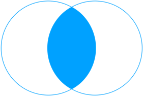
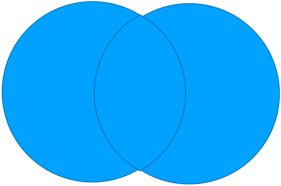

# 集合的操作

集合最常做的操作就是进行 交集 `intersection` 、并集 `union` 、差集 `difference` 以及对称差集 `symmetric_difference` 运算。

| 数据操作 | 示意图 |
|------|--|
|  **交集**    |  {width="140px"} |
|  **并集**   | {width="140px"} |
|  **差集**    | {width="140px"} |
|  **对称差集**   | {width="140px"} |

## 交集

交集操作可以使用 `intersection()` 方法，也可以使用 `&` 运算符。

```python
s1 = {1, 2, 3, 4}
s2 = {2, 3, 4, 5, 6}

print(s1.intersection(s2))  # {2, 3, 4}
# 或者使用 & 求交集操作
print(s1 & s2)  # {2, 3, 4}
```

## 并集

并集操作可以使用 `union()` 方法，也可以使用 `|` 运算符。

```python
s1 = {1, 2, 3, 4}
s2 = {2, 3, 4, 5, 6}

print(s1.union(s2))  # {1, 2, 3, 4, 5, 6}
# 或者使用 | 求并集操作
print(s1 | s2)  # {1, 2, 3, 4, 5, 6}
```

## 差集

差集操作可以使用 `difference()` 方法，也可以使用 `-` 运算符。

```python
s1 = {1, 2, 3, 4}
s2 = {2, 3, 4, 5, 6}

print(s1.difference(s2))  # {1}
print(s1 - s2)  # {1}
```

## 对称差集

对称差集集操作可以使用 `symmetric_difference()` 方法，也可以使用 `^` 运算符。

```python
s1 = {1, 2, 3, 4}
s2 = {2, 3, 4, 5, 6}

print(s1.symmetric_difference(s2))  # {1, 5, 6}
print(s1 ^ s2)  # {1, 5, 6}
```


